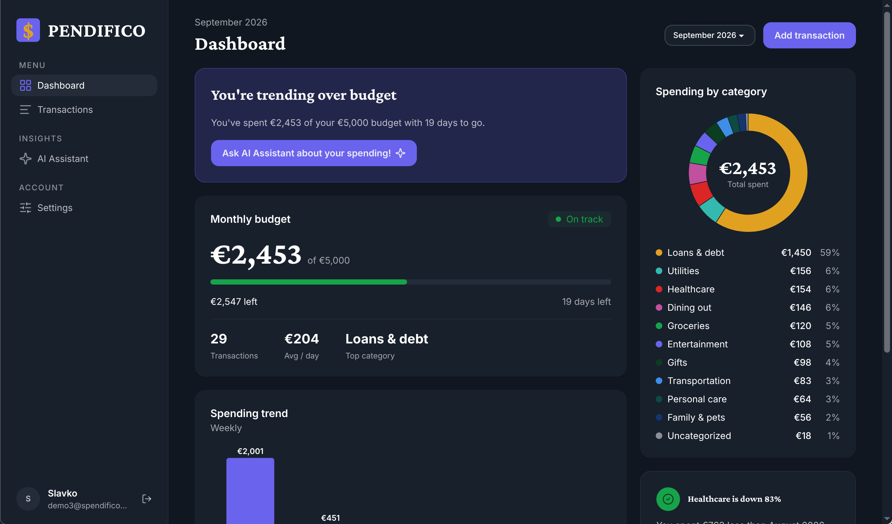
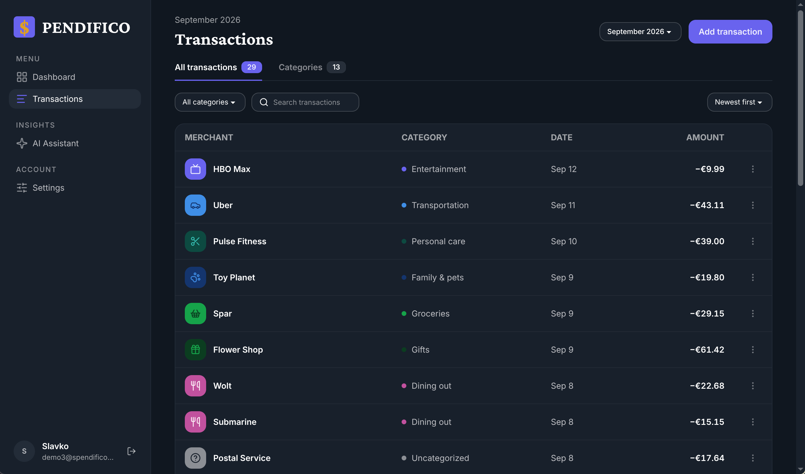
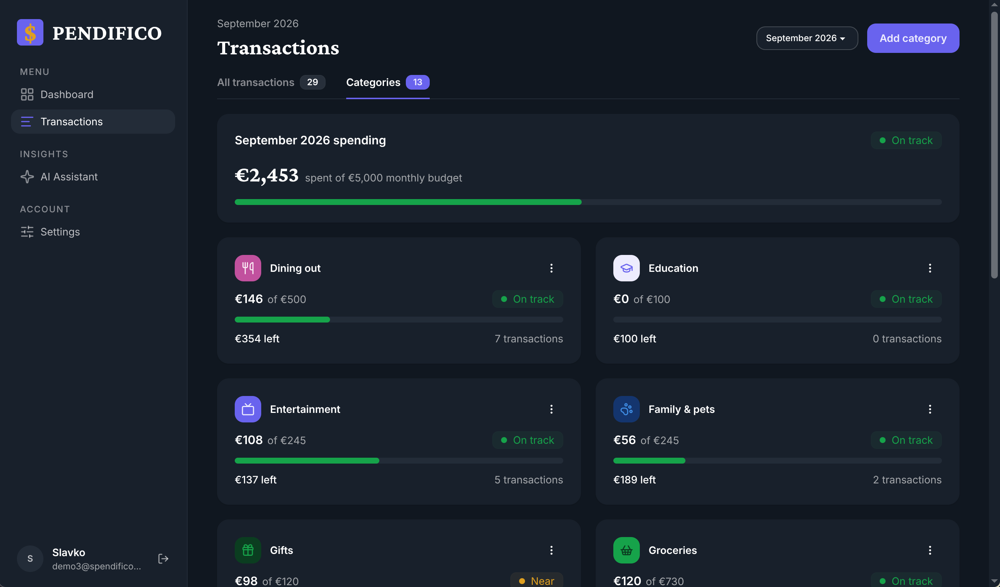
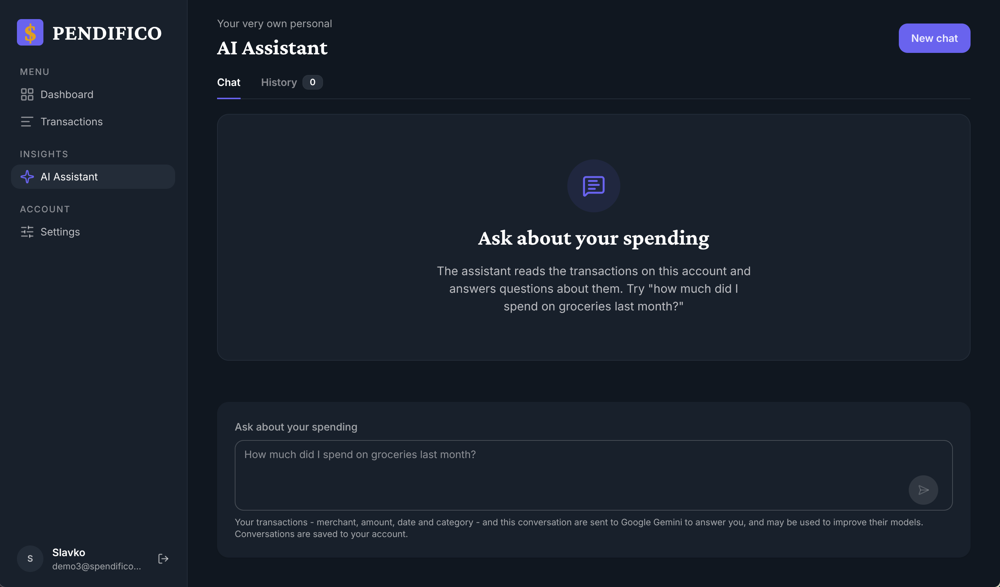
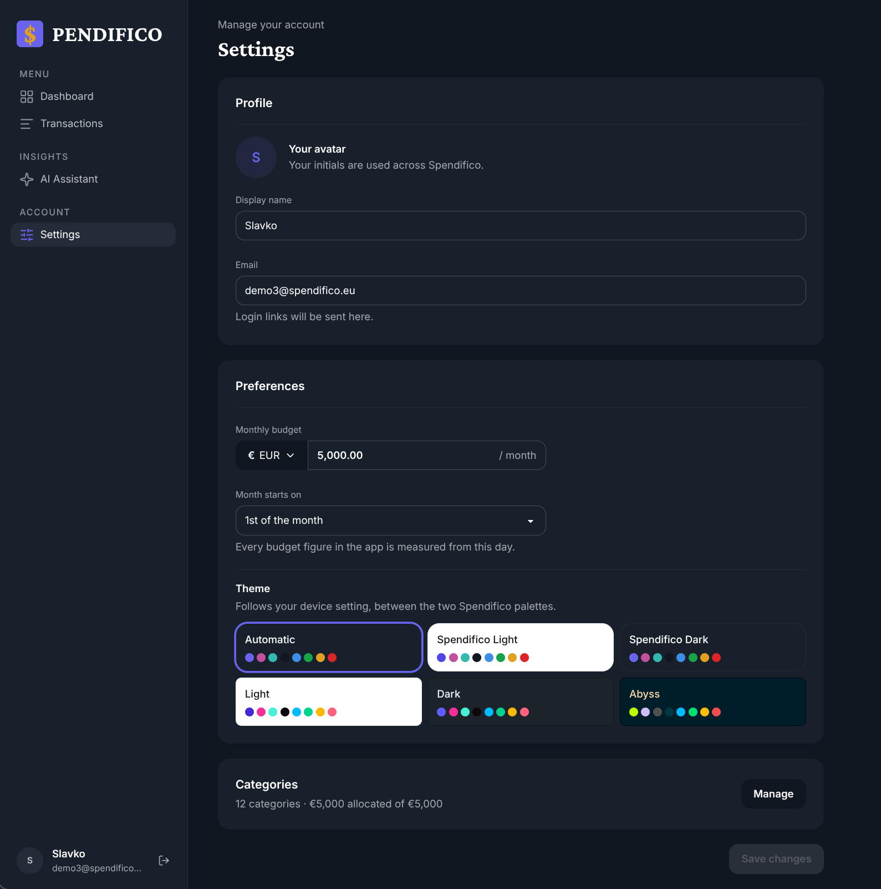

# Spendifico

Spendifico is a personal expense tracker. You log what you spend, and it shows where the money
went against a monthly budget: how much is left, which categories are over their cap, and how
this period compares with the last. Periods follow your paycheck rather than the calendar, and a
budget change applies from a date you choose instead of rewriting history. Access is passwordless,
by emailed single-use login link. An AI assistant answers questions about your own transactions,
and a receipt photo fills in a transaction for you.

Every user gets a database of their own. The API is NestJS, the frontend is Next.js, and one HTTP
contract generated from the backend keeps them honest with each other.

## Try it

**[Open the demo](https://spendifico.vercel.app/demo)**. One click, no sign-up, no email. You get
your own pre-seeded account with three years of spending on it, leased to you for an hour. Add,
edit and delete whatever you like; nobody else can see it, and the account is restored for the
next visitor when your lease ends. There are ten such accounts, so a busy moment can answer "the
demo is busy" for a while.

The app itself is at <https://spendifico.vercel.app>. The API behind it runs on Google Cloud Run at
<https://expenso-692959542833.europe-west1.run.app>; everything lives under `/api`, so
`/api/health` answers and `/` is a 404 by design. Its OpenAPI document is browsable at
[`/api/docs`](https://expenso-692959542833.europe-west1.run.app/api/docs).

**The public deployment sends no email.** The domain and mail service behind the login link are
gone, so the email form on the live site leads nowhere and `/demo` is the only working way in.
Locally the link is printed to the backend's terminal instead, and everything works. How to put a
mail provider back is in [Email](docs/guides/email.md); how the demo pool works is in
[Demo accounts](docs/guides/demo-accounts.md).

## What it looks like

| Dashboard | Transactions |
| --- | --- |
|  |  |

<details>
<summary>Categories, AI assistant and Settings</summary>







</details>

All five are in [`docs/screenshots/`](docs/screenshots), taken on a demo account in the dark theme.

## What it does

- **Passwordless access.** Register or log in with an email address; a single-use link signs you in
  for 30 days. Registering and logging in answer identically, so neither reveals whether an
  account exists. Sign out from the sidebar.
- **Dashboard.** Monthly budget with days left, weekly spending trend, spending by category, recent
  transactions, and an insight banner with up to two cards. The insights are **rule-based**
  detectors, deliberately not a language model, so they are deterministic and cost nothing.
- **Transactions.** A table scoped to a period, filtered by category, searched by merchant, sorted
  by date or amount. Add, edit and delete through modals; every row opens a detail page.
- **Receipt scanning.** Drop up to four receipt photos or one PDF into the Add transaction modal
  and Gemini fills in merchant, amount, date and category for you to confirm.
- **Categories.** Each with a colour, an icon, a spending cap and a status. Add, edit and delete
  them, or allocate the whole budget across caps in one step. New accounts start from a set of
  templates chosen during onboarding.
- **Paycheck periods.** A period runs from one payday to the next rather than from the first of
  the month. Budget, caps and the pay day are effective-dated histories: a change applies from a
  paycheck you pick and never rewrites the periods before it. The period select on every screen
  reaches the whole history, each period labelled.
- **AI assistant.** A chat over your own transactions, powered by Gemini. Conversations are saved,
  a History tab lists them, and a Stop button cancels a slow answer all the way to the model. This
  is the one place in the app a language model runs.
- **Settings.** Display name and email, budget with a EUR / USD / GBP picker, pay day, a six-way
  theme picker (automatic plus five themes, two of them Spendifico's own), and a Categories
  summary that opens a manage dialog.
- **Feedback.** One toast region reports every save, wherever the row landed.

## How it is built

- **Backend**: a NestJS API on port **3000**, all routes under `/api`. Drizzle ORM over Turso's
  SQLite engine, with a **database per user**: the central database holds only the user directory,
  the demo pool and the category templates, and everything about a person lives in their own
  database, created the first time they verify a login link. Locally that is plain files under
  `backend/databases/`, and no cloud account is needed.
- **Frontend**: a Next.js App Router app on port **4200**, the only thing that calls the API.
  Server Components fetch; Server Actions and a handful of small route handlers write. The design system
  is daisyUI on Tailwind with a custom theme pair, browsable in Storybook on **6006**. Charts are
  Recharts.
- **One contract.** The OpenAPI document is generated from the backend and committed, the
  frontend's types are generated from that, and CI fails if either drifts.
- **AI**: Google Gemini through `@google/genai`, for receipt scanning and the assistant. Both
  degrade to a clear "not available" when no key is configured, so the test suites run without one.
- **Deployment**: the frontend on Vercel, the API on Google Cloud Run in `europe-west1` (a Cloud
  Build trigger deploys every push to `main`), the databases on Turso Cloud. Details, rollback and
  the one-instance rule the architecture depends on are in [Deployment](docs/guides/deployment.md).

## Quick start

Node comes from [`.nvmrc`](.nvmrc); `nvm use` picks it up. Full prerequisites, including the
bundled-Node trap that catches people whose terminal cannot see `node`, are in the
[installation guide](docs/guides/installation.md).

<!-- sync: docs/guides/installation.md -->

```bash
npm install                                              # root: this is what installs the git hooks
cd backend  && npm install && cp .env.example .env       && cd ..
cd frontend && npm install && cp .env.example .env.local && cd ..
```

Both `.env` copies are optional: every variable has a working local default. Then one server per
terminal, in terminals you opened yourself:

```bash
cd backend  && npm run start:dev     # http://localhost:3000
cd frontend && npm run dev           # http://localhost:4200
```

With [mise](docs/guides/installation.md#optional-mise) installed, `mise run install` and
`mise run dev` do both of the above from the repo root.

```bash
curl http://localhost:3000/api/health
# {"status":"ok"}
```

Register on <http://localhost:4200>, then open the login link the backend prints to its terminal.
`http://localhost:3000/` returning 404 is correct: a global `api` prefix means the route is
`/api/health`. The local Swagger UI is at <http://localhost:3000/api/docs>.

## Showcase

[`docs/showcase/`](docs/showcase) holds what was built for the final presentation and is easy to
miss:

- [`statistics.html`](docs/showcase/statistics.html): the project by the numbers, as charts. Open
  it from disk; it needs no server and no network.
- [`diagrams.md`](docs/showcase/diagrams.md): the data model for both database scopes, the
  deployment map and the passwordless login flow, as Mermaid that GitHub renders in place.
- [`ai-vs-sql.md`](docs/showcase/ai-vs-sql.md): three questions put to the assistant, each
  answered independently in SQL, so you can see whether the model read the data or invented
  something plausible.

The showcase [README](docs/showcase/README.md) is written for running a live session, invite
links included, and reads accordingly.

## Built with AI agents

The code was generated by AI agents, mostly Claude Code, working from written plans. What that
meant in practice is visible in the repo rather than claimed:

- [`CLAUDE.md`](CLAUDE.md), [`backend/CLAUDE.md`](backend/CLAUDE.md) and
  [`frontend/CLAUDE.md`](frontend/CLAUDE.md) hold the reasoning: why the ports are asymmetric,
  why registration provisions no database, why Tailwind's palette is cleared, which traps a
  green build cannot see. They are written for the agent and are just as readable by people.
- [`docs/agents/`](docs/agents) carries the cross-cutting rules: the HTTP contract pipeline, the
  working conventions, the Claude tooling inventory.
- [`.claude/`](.claude) commits the skills, subagents and permissions, so a fresh clone gets the
  same tooling. [`.claude/SETTINGS.md`](.claude/SETTINGS.md) explains every permission decision.
- [`docs/plans/`](docs/plans) has one implementation plan per ticket, written before the code and
  committed as the branch's first commit, never edited afterwards. The deferred-work register,
  [`docs/TODO.md`](docs/TODO.md), records what was left out and why.

**These docs answer how; the CLAUDE files answer why.** No fact is written in both places, and
`npm run docs:check` fails a pull request that breaks a path or a link.

## Documentation

| Guide | For |
| --- | --- |
| [Installation](docs/guides/installation.md) | Node, mise, the three installs, `gh`, running both apps |
| [Commands](docs/guides/commands.md) | Every script in either app, plus the mise tasks |
| [Configuration](docs/guides/configuration.md) | Every environment variable and what a missing one does |
| [Database](docs/guides/database.md) | Local files, trying the access flow, schema changes, Turso Cloud |
| [Demo accounts](docs/guides/demo-accounts.md) | The pool behind `/demo`: seeding it, turning it on, what can go wrong |
| [Email](docs/guides/email.md) | Why the deployment sends none, and how to re-enable a provider |
| [Seeding dummy data](docs/guides/seeding-dummy-data.md) | Filling a showcase account, locally or in Turso Cloud |
| [Deployment](docs/guides/deployment.md) | Cloud Run, Vercel and Turso Cloud: how a merge deploys, rollback, the one-instance rule |
| [Troubleshooting](docs/guides/troubleshooting.md) | Symptom to cause, for the whole repo |
| [Contributing](docs/CONTRIBUTING.md) | Branches, commits, the hooks, what CI checks |

[`docs/README.md`](docs/README.md) indexes everything else under `docs/`: the plans, the
deferred-work register, the explainers, and the brief, spec and handout the project is built from.

## Repository layout

```text
backend/     NestJS API on :3000. Its own package.json, and its own CLAUDE.md
frontend/    Next.js on :4200, Storybook on :6006. Same
docs/        Guides, plans, the TODO register, the showcase, screenshots, agent-facing notes
.claude/     Claude Code skills, subagents and permissions
mise.toml    Optional task runner. Pins the Node major a second time
```

Three `package.json` files, each installed separately, and the root one is not optional: its
`prepare` script is what installs the git hooks. Run app commands from inside that app's
directory.

## Contributing

Never commit or push directly to `main`; branch as `{type}/PET-{number}-{slug}`. Commit messages
are Conventional Commits, enforced by a hook. The details, including how this repo uses stacked
branches, are in [`docs/CONTRIBUTING.md`](docs/CONTRIBUTING.md).

## About

Built by two people in two weeks at the DECODE Agentic Academy, using AI agents (Claude Code) to generate the
code. [Iskren](https://github.com/izkreny) did mostly the backend, I ([Ante](https://github.com/AntePrkacin)) did mostly the frontend, with some parts shared.

Released under the [MIT License](LICENSE).
