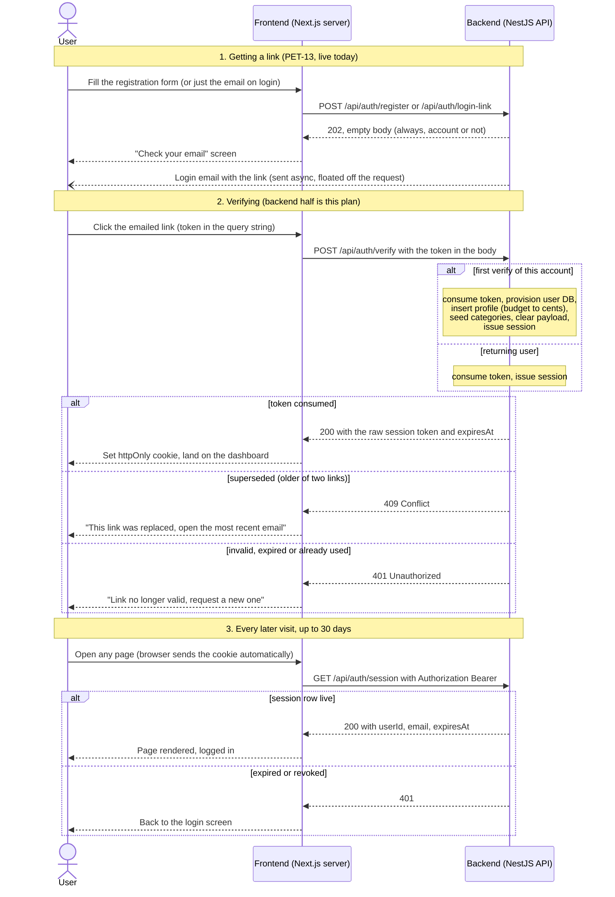
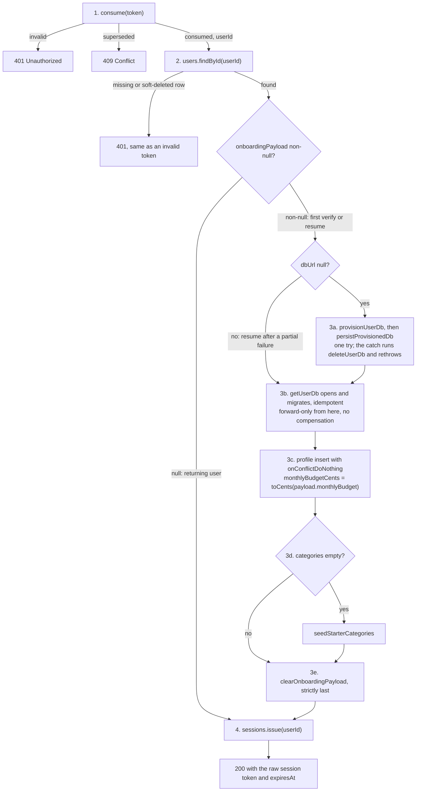
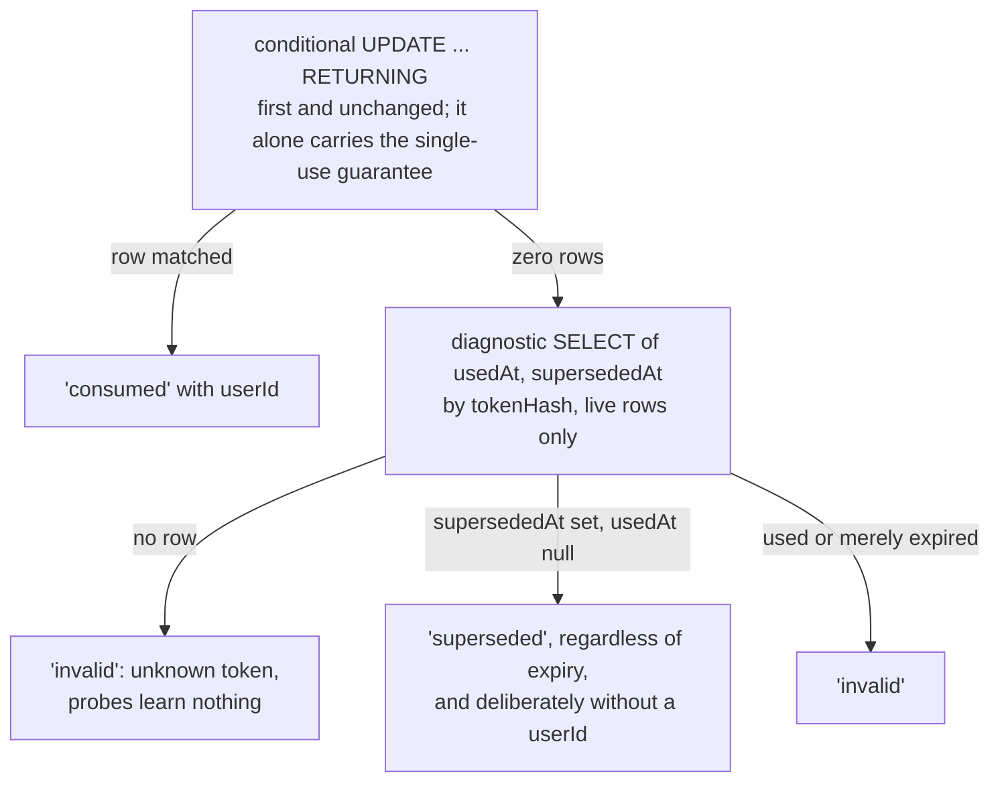
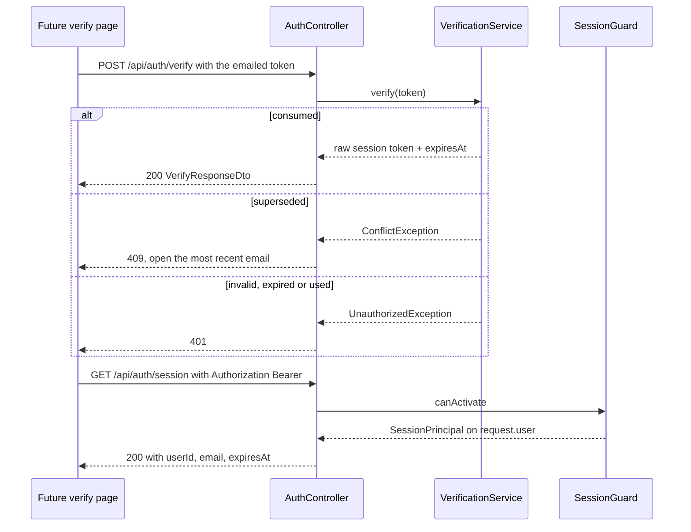
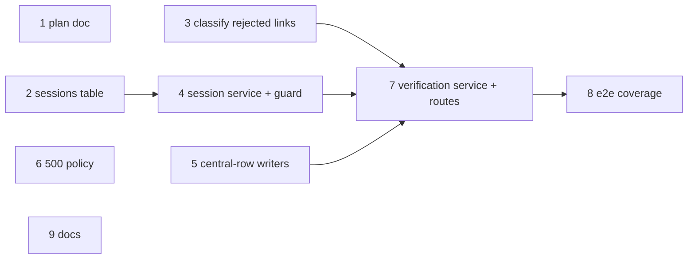

# PET-14: link verification and sessions (backend half)

## Context

PET-13 landed the issuing half of the magic-link flow: `POST /api/auth/register` and
`POST /api/auth/login-link` create accounts and send links, and
`LoginTokenService.consume()` exists and is tested. Nothing consumes a link yet: no verify
route, no session, no guard, no authenticated endpoint. PET-14 ("[FULL] Implement
login-link verification and sessions", 8 points) closes that gap, and per its 2026-08-02
scope addition also owns everything registration deliberately deferred: provisioning the
user's Turso database, inserting the profile from `users.onboarding_payload` (converting
`monthlyBudget` to cents at that boundary), seeding starter categories, and clearing the
payload.

Branch `feat/PET-14-link-verification-and-sessions` is stacked on top of
`feat/PET-50-api-openapi-typegen` (cut at `60aecd9`, PR #8 still unmerged) using GitHub's
stacked branches feature: no manual rebase needed, GitHub restacks this branch when its
parent merges.

The whole flow as the three actors see it. Section 1 is live today (PET-13), the backend
half of sections 2 and 3 is this plan, and the frontend's verify page and cookie plumbing
follow on a later branch:



The user never talks to the backend directly: every backend arrow originates at the
Next.js server, which is why the backend needs no cookies and no CORS credentials. The
email is the one asynchronous arrow (the 202 answers before the mail leaves), and the
token changes identity at step 2: the emailed login token dies on consumption and the
session token takes over.


### Decisions made

- **Backend only on this branch.** The frontend verify page, session cookie plumbing and
  dashboard follow on a later branch: provisioning is the slowest step in the flow and
  A33/A19 design no loading state, so the screen experience between "link clicked" and
  "dashboard shown" deserves its own pass once the backend contract is real and its
  latency measurable. The only frontend change here is the regenerated
  `frontend/src/types/api.d.ts`.
- **One blocking verify call.** `POST /api/auth/verify` consumes the token, provisions,
  inserts the profile, seeds categories, creates the session, then responds. Simplest and
  most robust (one compensation path); provisioning is seconds, not minutes. The
  alternatives (session-first with lazy provisioning, or verify-plus-status-polling) move
  the unpredictable wait into dashboard fetches or add a state machine for a wait of a
  few seconds.
- **Sessions are opaque DB-backed tokens sent as a Bearer header.** New central `sessions`
  table storing a SHA-256 hash (the `login_links` pattern: 256-bit random token, hash is
  the indexed lookup key, no timing-sensitive comparison). Verify returns the raw token in
  the response body; the future frontend keeps it in its own httpOnly first-party cookie
  and forwards it server-side. No cookie-parser, no CORS credentials, deployment-agnostic.
  A stateless JWT was rejected: it needs a secret (breaking the no-`.env` boot invariant
  unless defaulted) and gives up server-side revocation, which A39's missing logout will
  eventually want.
- **Minimal `GET /api/auth/session` behind the new guard.** Central `users` has no name
  columns (names live in the per-user profile), so it returns only
  `{ userId, email, expiresAt }`. The full `getProfile()` with preferences is PET-45's.
- **`mintUserDbToken(dbName, expiry)` stays a documented stub.** Nothing in PET-14's ACs
  consumes it and no client syncs with Turso directly; `docs/TODO.md` re-homes it to the
  future browser-direct-sync feature.
- **Distinguishing "superseded" is in scope.** The Gmail-threading fix `docs/TODO.md`
  explicitly assigns to PET-14: `consume()` gains a richer return type without losing
  single-statement atomicity, and the verify contract lets the future frontend say "this
  link was replaced by a newer one, check your inbox for the most recent email".

## Design

### The verify orchestration (new `VerificationService`, `src/auth/verification.service.ts`)

Order: (1) `consume(token)` first, it IS the authentication; (2) `users.findById(userId)`,
a missing or soft-deleted row answers 401 like an invalid token (do not reveal deletion);
(3) if `onboardingPayload` is non-null (never fully verified, possibly half-provisioned):

- a. If `dbUrl` is null: `provisionUserDb(userId)` then `persistProvisionedDb(...)`, **both
  inside one try whose catch runs `deleteUserDb(userId)` (its own `.catch` logging loudly:
  orphaned cloud db, name, manual cleanup needed) then rethrows the original error** (the
  PR #3 review's finding 1: a create success followed by a mint failure otherwise orphans
  a cloud database nothing reclaims). If `dbUrl` is already set (cloud resume after a
  partial failure), skip both. In local mode `provisionUserDb` returns nulls and never
  touches the Platform API, so CI and the e2e suite stay offline.
- b. `getUserDb(userId)` opens and migrates idempotently. **No compensation from here on**:
  once the pointer is persisted, deleting the database would strand a row that the resume
  logic (keyed on `dbUrl != null`) would never re-provision. Forward-only recovery.
- c. Profile insert with `.onConflictDoNothing()`, `id = userId`,
  `monthlyBudgetCents = toCents(payload.monthlyBudget)`.
- d. Seed: `SELECT ... FROM categories LIMIT 1`; if empty,
  `seedStarterCategories(userDb, payload.categories)` (unchanged, exactly as its doc
  comment promises). The seed is one multi-row INSERT, atomic per statement, so "any row
  exists" is a safe skip condition.
- e. `clearOnboardingPayload(userId)` **strictly last**: the non-null payload is both the
  source data and the "provisioning may be incomplete" marker; clearing it earlier would
  lose the profile source forever.

Then (4) `sessions.issue(userId)`, respond `{ token, expiresAt }`. Returning user (payload
null): steps 3a-3e are skipped entirely; verify is consume, one read, one session insert.

The orchestration as a graph, rejection exits and resume branches included:



Re-runnability contract: a mid-flight failure answers 500 through `AllExceptionsFilter`
with the token already burned; "Resend link" then clicking the new email is the only
recovery (the design's own answer, A36/VER-2), and the re-verify **resumes** each partial
state rather than crashing or double-inserting:

| Failure point                        | State left behind                    | Recovery on next verify                    |
| ------------------------------------ | ------------------------------------ | ------------------------------------------ |
| provision fails (create ok, mint no) | compensation deleted the cloud db    | full re-run                                |
| persist pointer fails                | compensation deleted the cloud db    | full re-run                                |
| compensation itself fails            | orphaned cloud db, pointer null      | re-provision 500s on the name collision until ops deletes the orphan (accepted, logged) |
| open/migrate fails                   | pointer set, payload set             | skips provision, retries open              |
| profile insert fails                 | db exists, no profile                | `onConflictDoNothing` insert retried       |
| seed fails                           | profile exists, no categories        | profile no-ops on conflict, seed retried   |
| payload clear fails                  | fully provisioned, payload still set | profile no-ops, seed skipped, clear retried |
| session insert fails                 | fully verified, payload null         | returning-user path: just issues a session |

Nothing in verify is floated, unlike `AuthService`: the caller holds a real emailed token
so there is no enumeration-timing rationale, and the response must not claim a session
that provisioning failed to earn. State this in the class comment so nobody "fixes" verify
to float like register does.

`deleteUserDb`'s in-flight-open foot-gun (PR #3 review finding 6) is already defused
(`user-database.service.ts` awaits `opening`), and verify's compensation runs strictly
before its own `getUserDb` call, so no new exposure.

### Richer `consume()` (`src/auth/login-token.service.ts`)

New exported type:

```ts
export type ConsumeResult =
  | { status: 'consumed'; userId: string }
  | { status: 'superseded' }
  | { status: 'invalid' };
```

The conditional UPDATE stays byte-identical and stays first; it alone carries the
single-use guarantee. **Only when it matches zero rows** does a diagnostic SELECT of
`{ usedAt, supersededAt }` by `tokenHash` (live rows only) run against the unique index.

Classification rules: no row is `'invalid'` (unknown token, probes learn nothing); a row
with `supersededAt != null && usedAt == null` is `'superseded'` **regardless of expiry**
(a superseded-and-expired link still means "a newer link was issued"; if the newest is
also expired, its click yields the generic 401 and the request-a-new-link path, which
degrades gracefully); a used or merely expired row is `'invalid'`. Used and superseded are
mutually exclusive by construction (`issue()` supersedes only unused rows, `consume()`
spends only non-superseded ones); record the invariant in a comment.

The classification as the code will branch:



Security calculus, to be commented in the code: `'superseded'` is returned only for a
hash-matched row, i.e. to a caller holding a token that was actually emailed to the
account owner. Random probes always see `'invalid'`, so no enumeration channel opens, and
`'superseded'` deliberately carries no `userId`: a dead token authenticates nobody. The
method doc's "the caller cannot tell which, and does not need to" paragraph is now wrong
and gets replaced with this. Race note: between the missed UPDATE and the SELECT a
concurrent winner may set `usedAt`; the loser then correctly reports `'invalid'`. The
SELECT is diagnostic prose, never check-then-act.

### HTTP contract

`POST /api/auth/verify`, token in the **body**: a POST from the future Next route handler
keeps it out of backend access logs; the emailed query-string exposure is unchanged and
already documented.

- `VerifyLoginLinkDto` (`src/auth/dto/verify-login-link.dto.ts`): `token` with
  `@IsString() @IsNotEmpty() @MaxLength(128)` (the raw token is 43 chars; the bound stops
  megabyte bodies from being hashed while leaving format headroom).
- Success: `@HttpCode(HttpStatus.OK)` 200 with `VerifyResponseDto`
  (`src/auth/dto/verify-response.dto.ts`): `token` (the raw opaque session token, the only
  place it ever exists in a response) and `expiresAt` (ISO 8601, via explicit
  `.toISOString()` so the declared type is honest). Not 201: the session is not
  URL-addressable. No userId/email in the body: `GET /api/auth/session` exists precisely
  to answer "who am I".
- Rejections: **401** `UnauthorizedException('This login link is invalid, expired or
  already used.')` for `'invalid'`; **409** `ConflictException('This login link was
  replaced by a newer one. Open the most recent email.')` for `'superseded'`. 409 over
  410 because "the request conflicts with the current state: a newer credential exists" is
  exactly the semantics, `ApiErrorResponse` already carries a 409 description, and 410's
  "gone forever" prose fits used/expired better than superseded. `ErrorResponseDto`'s
  fixed shape suffices: the future frontend keys on `statusCode` alone. Plus 400 from the
  ValidationPipe and 429 from the surviving ip throttler. The `@ApiOperation` description
  must spell out what 409 means, since the shared decorator prose is generic.

`GET /api/auth/session`: on `AuthController`, `@UseGuards(SessionGuard) @ApiBearerAuth()`,
returns `SessionResponseDto` (`src/auth/dto/session-response.dto.ts`):
`{ userId, email, expiresAt }` mapped from `@CurrentUser()`. Errors: 401 only.

The two operations end to end, happy path and both rejections:



### Sessions table, service, guard

Table in `src/database/central/schema.ts`, same conventions as `loginLinks` (UUIDv7 text
PK via `newId()`, epoch-ms `timestamp_ms` columns with `$defaultFn`/`$onUpdateFn`, no FK
by the schema-wide convention, nullable `deletedAt`): `id`, `userId`, `tokenHash`,
`expiresAt`, `createdAt`, `updatedAt`, `deletedAt`;
`uniqueIndex('sessions_token_hash_unique')` and `index('sessions_user_id_idx')` (ops:
revoke all of one user's sessions). The `tokenHash` comment points at
`LoginTokenService`'s class comment for the hash-as-lookup-key rationale; the `deletedAt`
comment says the tombstone doubles as manual revocation, no logout endpoint by design
(A39). `npm run db:generate`, commit `drizzle/central/<ts>_add_sessions/`. Trap: only the
central scope should emit anything; a user-scope diff means an accidental edit. New table,
so the RC differ's created/dropped-only limitation is not in play.

`SessionService` (`src/auth/session.service.ts`):

- `issue(userId): Promise<{ token: string; expiresAt: Date }>`:
  `randomBytes(32).toString('base64url')`, store hex SHA-256,
  `expiresAt = now + SESSION_TTL_D days`. Single INSERT, no transaction, no queue: nothing
  to supersede, concurrent sessions per user are legitimate (one per device).
- `validate(rawToken): Promise<SessionPrincipal | null>` where
  `SessionPrincipal = { userId, email, expiresAt }`: **one indexed read**, an inner join
  `sessions -> users` with WHERE `tokenHash = hash AND sessions.deletedAt IS NULL AND
sessions.expiresAt > now AND users.deletedAt IS NULL`. Expiry in the WHERE, matching
  `consume()`: one round trip, and the compared instant is app-generated either way.
- **Fixed expiry, not sliding**, default 30 days (`SESSION_TTL_D`). Sliding turns every
  authenticated read into a central-db write (on a sync-replicated file, with `updatedAt`
  churn) and buys nothing A34's "normal persistent session" asks for; re-login is one
  email click. Pin "validate performs no UPDATE" in a unit test so a future change to
  sliding is deliberate.
- Reuse `hashToken` by exporting it from `login-token.service.ts`: one definition of "how
  a token becomes a key".

`SessionGuard` (`src/auth/session.guard.ts`): `CanActivate`; parse
`Authorization: Bearer <token>` (scheme case-insensitive, single token); missing header,
wrong scheme or failed `validate` throws `UnauthorizedException` (distinct messages are
fine: session tokens are the caller's own, no enumeration concern); on success attach the
principal to `request.user`. `@CurrentUser()` param decorator
(`src/auth/current-user.decorator.ts`) returns it typed as `SessionPrincipal`.

**Guard placement: per-route `@UseGuards(SessionGuard)`, not a global `APP_GUARD`.**
Exactly one guarded endpoint exists; a global guard would force `@Public()` onto four
routes to protect one. The switch point, to note in CLAUDE.md: when PET-45 makes guarded
routes the majority, flip to `APP_GUARD` plus `@Public()` on hello/register/login-link/
verify. `AuthModule` providers gain `VerificationService`, `SessionService`,
`SessionGuard`; exports `[SessionService, SessionGuard]` so future feature modules just
import `AuthModule`. `DatabaseModule` is `@Global`, so `UserDatabaseService` and `APP_DB`
need no import changes.

### Throttling

Both new routes stay on `AuthController`, whose controller-level `ThrottlerGuard` runs
with explicit named skips:

- verify: `@SkipThrottle({ email: true })`. The email tracker has no email to key on and
  degrades to a shared `no-email:<ip>` bucket of 5/900s that one legitimate journey
  (verify, hit 409, resend, verify again) plus any garbage register traffic would exhaust.
  The ip throttler (30/900s default) stays: verify is unauthenticated and probe-shaped, so
  a uniform pre-validation 429 costs nothing. Verify documents 429.
- session: `@SkipThrottle({ email: true, ip: true })`. A one-indexed-read whoami the future
  frontend will call on navigation; 30/900s per IP would break a NAT'd classroom's normal
  browsing (the same NAT argument the limiter defaults already record). The guard's 401 is
  the defense; 256-bit tokens make probing pointless. Session documents no 429.
- **Silent trap:** a bare `@SkipThrottle()` sets `{ default: true }`, and no throttler
  here is named `default`, so it would skip nothing, silently. The named form is
  mandatory. Guards run before pipes, so the skipped email tracker never sees the verify
  body anyway.

### UsersService and money

`UsersService` gains three methods in its existing style (live-row filters everywhere):
`findById(id)` returning `{ id, email, dbUrl, onboardingPayload } | null` (a second
interface rather than over-fetching `dbAuthToken`, which verify never needs);
`persistProvisionedDb(userId, { dbUrl, dbAuthToken })` (an UPDATE of the two nullable
pointer columns; `dbName` is already set and derives from the id); and
`clearOnboardingPayload(userId)` (`set({ onboardingPayload: null })`).

`toCents(major: number): number` = `Math.round(major * 100)` in new `src/common/money.ts`,
with the JPY/KWD two-decimal caveat comment (already in TODO's scaling list). First money
conversion in the repo; the schema comments already promise "converted to cents at the
profile boundary", and transactions will reuse it. `VerificationService` calls it, since
"how a payload becomes a profile" is that service's one job.

## Steps

### 1. Sessions table (`src/database/central/schema.ts`)

Per Design. Export `SessionRow`/`NewSessionRow`. `npm run db:generate`, commit the new
central migration directory.

### 2. Richer consume (`src/auth/login-token.service.ts`)

Per Design. Keep the UPDATE first and untouched; add the diagnostic SELECT on the miss
path only; replace the now-wrong doc paragraph; export `hashToken`. Callers: only the new
`VerificationService`; the e2e suite's direct-consume assertions change shape (step 11).

### 3. Env (`src/config/env.validation.ts`, `.env.example`, `env.validation.spec.ts`)

`SESSION_TTL_D: Joi.number().integer().positive().default(30)` with a comment: days,
fixed expiry (not sliding), A34's "normal persistent session". Mirror into `.env.example`
in the commented style under the login-link TTL block. Spec updates: the defaults object
gains `SESSION_TTL_D: 30`, plus a value-constraint case rejecting `'0'` and `'2.5'`. The
no-`.env` boot invariant holds because the variable has a default.

### 4. Session service, guard, decorator

New files per Design. The guard's file comment states the per-route-vs-global decision
and the switch point.

### 5. Users writers (`src/users/users.service.ts`)

Per Design, plus spec updates (step 10).

### 6. OpenAPI 500 policy (`src/app.controller.ts`, `src/openapi.document.ts`)

**Resolve `docs/TODO.md`'s open question as: no operation documents 500.** Remove
`@ApiErrorResponse(HttpStatus.INTERNAL_SERVER_ERROR)` from `AppController.getHello`; add
one line to the document description in `openapi.document.ts`: every operation can answer
500 with `ErrorResponseDto` via the global filter. Rationale: the per-operation 500 is
the same non-actionable fact on every operation, it bloats every generated response
union, and hello was the arbitrary outlier the TODO item flagged.

### 7. Verification service (`src/auth/verification.service.ts`)

Per Design. Structure the compensated block exactly:
`try { provisioned = await provisionUserDb(); await persistProvisionedDb(); } catch (e) { await deleteUserDb().catch(<log loudly>); throw e; }`
and nothing else inside it. Comment the accepted consequence of `.onConflictDoNothing()`
(an existing profile row wins over a re-registered payload). The class comment states:
nothing here is floated and why that differs from `AuthService`, and the re-runnability
contract in prose.

### 8. Controller + DTOs (`src/auth/auth.controller.ts`, `src/auth/dto/`)

Per Design. Verify handler: `@Post('verify') @HttpCode(HttpStatus.OK)
@SkipThrottle({ email: true }) @ApiOperation(...409 meaning...)
@ApiOkResponse({ type: VerifyResponseDto }) @ApiErrorResponse(400, 401, 409, 429)`.
Session handler: `@Get('session') @UseGuards(SessionGuard)
@SkipThrottle({ email: true, ip: true }) @ApiBearerAuth()
@ApiOkResponse({ type: SessionResponseDto }) @ApiErrorResponse(401)`. Update the
controller's class comment: it no longer holds only identical-202 routes; say which routes
carry which limiter and why. Traps: DTOs must be classes in `.dto.ts` files or the plugin
silently emits `{}`; `expiresAt` needs an explicit `.toISOString()`.

### 9. OpenAPI plumbing

- `openapi.document.ts`: `.addBearerAuth()` on the `DocumentBuilder` (default scheme name
  `bearer`, matching bare `@ApiBearerAuth()`); without it the generated frontend types
  show no auth, silently.
- `api-error-response.decorator.ts`: add
  `[HttpStatus.UNAUTHORIZED]: 'Not authenticated. The bearer credential is missing, invalid, expired or already spent.'`
  to `DESCRIPTIONS`.
- `turso-platform.service.ts`: re-home the `mintUserDbToken` stub's doc comment
  ("It arrives with the auth feature" is no longer true; it now belongs to the future
  browser-direct-sync feature). Keep it unimplemented.
- After all route work: root `npm run api:sync`, commit `backend/openapi.json` and
  `frontend/src/types/api.d.ts` (CI drift-gates both).

### 10. Unit tests

Mirror the existing idioms (`test/query-chain.ts`, `argsOf`/`toSql`/`paramsOf`,
hand-constructed services with mocked collaborators).

- `login-token.service.spec.ts`: existing consume cases reshaped to the new results; the
  diagnostic SELECT is skipped entirely when the UPDATE succeeds (pins the hot path
  staying one statement); a hash-matched superseded row classifies without spending
  anything (WHERE carries the sha256, never the raw token); an unknown token is invalid
  and learns nothing; a used row is invalid, never superseded; a superseded row that has
  also expired still reports superseded; the SELECT runs only after the UPDATE missed.
- `session.service.spec.ts` (new): stores only the hash of the returned token; 43-char
  base64url token; expiry from `SESSION_TTL_D` (default 30, override honored,
  bounded-window assertions like the login-token TTL tests); validate WHERE carries hash,
  expiry and both tombstone arms, params never the raw token; null on miss, principal on a
  row; **validate performs no UPDATE**.
- `session.guard.spec.ts` (new): no header 401 without calling validate; `Basic` scheme
  401; bearer with validate-null 401; success attaches `{ userId, email, expiresAt }` to
  `request.user` and returns true; `bearer`/`Bearer` case-insensitivity.
- `verification.service.spec.ts` (new, ~12 cases): invalid consume throws
  `UnauthorizedException` touching nothing else; superseded throws `ConflictException`
  provisioning nothing; consumed-but-`findById`-null throws 401; first-verify happy path
  pins call order provision -> persist -> getUserDb -> profile -> seed -> clear -> session,
  `monthlyBudgetCents: 200050` for a 2000.5 payload, and `.onConflictDoNothing()`;
  returning user only issues a session; provision rejection calls `deleteUserDb` and
  rethrows; persist rejection ditto; getUserDb rejection after persist does NOT
  compensate; resume with `dbUrl` set and payload non-null skips provision/persist but
  runs profile/seed/clear; categories already present skips seed; payload clear runs after
  seed (pins the last-step rule); compensation failure is logged and the original error
  still propagates.
- `users.service.spec.ts` (+3): `findById` returns the four fields and filters live rows,
  null on miss; `persistProvisionedDb` sets exactly the two pointer columns on a live row;
  `clearOnboardingPayload` sets the payload NULL on a live row.
- `money.spec.ts` (new): `toCents(2000.5) === 200050`; float-noise `toCents(4.02) === 402`;
  the DTO's upper bound stays a safe integer.

### 11. E2e tests

Extract `MemoryMailer` from `test/auth.e2e-spec.ts` into `test/memory-mailer.ts` (same
waitFor/quiesce semantics; `query-chain.ts` is the shared-helper precedent) and import it
back. New `test/verify.e2e-spec.ts`: fixture grabs `APP_DB`, `LoginTokenService` and
`UserDatabaseService` from the compiled module; inspect the user db via
`getUserDb(id)` (sharing the service's handle) rather than a second driver instance;
fresh `nextEmail()` per test (the email limiter is 3 in e2e); tokens from
`loginTokens.issue(userId)` directly, except the one full journey which parses the emailed
link.

Cases (~14):

1. **Full journey, the mirror image of registration's "provisions nothing" test**:
   register, extract the token from the email, verify 200 with a 43-char session token and
   a future ISO `expiresAt`; the user db file exists under
   `<dir>/users/expensa-user-<id>.db`; profile row with `monthlyBudgetCents` 200050,
   currency and `monthStartDay`; categories exactly the picked names in canonical order
   with the Figma colors; central row: payload NULL, `dbUrl`/`dbAuthToken` still NULL
   (local mode), `dbName` unchanged.
2. AC4: `GET /api/auth/session` with the bearer answers `{ userId, email, expiresAt }`,
   twice.
3. AC2: the same link again answers 401, body keys match `ErrorResponseDto`, no second
   `sessions` row.
4. Gmail fix: issue two links; the older answers **409**, the newer 200. Distinguishable
   by `statusCode` alone.
5. AC3: a seeded expired link answers 401.
6. An unknown token answers 401 with the same body shape as used/expired.
7. Returning user: verify, request a new link, verify it: 200 and a second session; still
   one profile row, categories not duplicated, payload still NULL; the first bearer still
   validates (concurrent sessions).
8. Re-registration before verify: the corrected payload wins in the profile.
9. Empty categories selection: verify 200, profile exists, zero category rows.
10. AC5: session with no header 401; with a garbage bearer 401.
11. A seeded expired session row (past `expiresAt`, known raw token) answers 401.
12. Verify skips the email limiter: `RATE_LIMIT + 1` unknown-token verifies all answer
    401, never 429 (with the fallback bucket at 3, the fourth would 429 on regression).
13. `POST verify {}` answers 400 naming `token`.
14. Update the existing `LoginTokenService, against the real database` describe in
    `auth.e2e-spec.ts` to the new result shape, including `{ status: 'superseded' }` and
    the concurrent-consume filter on `status === 'consumed'`.

`test/openapi.e2e-spec.ts` (from 11 to ~21 tests): the pinned path list becomes exactly
`['/api/auth/login-link', '/api/auth/register', '/api/auth/session', '/api/auth/verify', '/api/hello']`;
verify pins 200 `$ref` VerifyResponseDto with `token` and `expiresAt` required (the
silent-`{}` pin), 400/401/409/429 all `$ref` ErrorResponseDto, and the exact list
`['200','400','401','409','429']`; session pins 200 SessionResponseDto required
`['userId','email','expiresAt']`, the exact list `['200','401']`, and **the operation
carries `security: [{ bearer: [] }]` with `components.securitySchemes.bearer =
{ type: 'http', scheme: 'bearer' }`** (pins the addBearerAuth/@ApiBearerAuth pairing);
hello gains an exact-list pin of `['200']`, sealing the 500 decision; the two 202 routes'
pinned lists stay untouched.

### 12. Docs

- **CLAUDE.md**: under Architecture, a new passage on verification and sessions: the one
  blocking verify call and its step order; 401 vs 409 semantics and why superseded is safe
  to disclose; sessions as hashed opaque bearers with fixed `SESSION_TTL_D` expiry, no
  cookies, no logout (revocation = tombstone); the per-route guard with the `APP_GUARD`
  switch point; cents conversion at the profile boundary in `VerificationService`; the
  re-runnability contract ("a resent link completes a half-provisioned account"). Env
  table: `SESSION_TTL_D | 30 | Session lifetime in days; fixed expiry, not sliding`.
  "Not yet built": shrink the verification bullet to the frontend halves (verify page,
  cookie plumbing, dashboard) and PET-45's `getProfile`. Note the 500 policy under the
  contract section.
- **README.md**: count `SESSION_TTL_D` among the tuning knobs; add the verify/session curl
  pair to the smoke steps if the README carries them.
- **docs/TODO.md**: delete the "Link verification and sessions" deferred item, carrying
  its verify-page material forward into a new deferred item for the frontend verify page
  (the query-string exposure, the zero-live-links failure mode, and the
  blank-wait-until-measured decision); add an
  Operational one-liner (Gmail still threads the login emails, the 409 now explains a
  wrong click, varying the subject stays available if inbox confusion persists); re-home
  `mintUserDbToken`; delete the Housekeeping "hello documents a 500" item (resolved: none
  does); extend "Login links are never purged" to cover `sessions` rows; add session
  revocation as a manual tombstone and the orphaned-cloud-db double-failure state with its
  ops fix (delete via the Turso MCP or Platform API; the CLI name-cache item covers why
  not the CLI).

## Commits

1. `docs: plan link verification and sessions` (this file)
2. `feat(backend): add the sessions table`
3. `feat(backend): classify rejected login links in consume`
4. `feat(backend): add the session service and bearer guard` (needs 2)
5. `feat(backend): add the central-row writers verification needs`
6. `refactor(backend): document the blanket 500 once, not per operation` (small on purpose,
   so the decision is visible)
7. `feat(backend): verify login links into provisioned accounts and sessions` (needs 3, 4, 5)
8. `test(backend): cover verification end to end` (needs 7)
9. `docs: record the verification flow and session contract`

2, 3, 5 and 6 are independent of each other. As a graph, where unconnected commits can
land in any order:



## Verification

1. `cd backend && npm run lint && npm run build` (build is the typecheck gate).
2. `npm test` (roughly +37 cases across six touched or new spec files) and
   `npm run test:e2e` (openapi grows from 11 to ~21 tests). Run both before every commit:
   the pre-commit hook skips backend tests and this branch has no CI until PR #8 merges.
3. Root `npm run api:sync` then `git status`: no drift beyond what is committed (mirrors
   both CI gates).
4. Local no-`.env` smoke (`npm run start:dev`):
   - register: 202 empty, LogMailer prints the link; copy `token=<RAW>`;
   - `POST /api/auth/verify {"token":"<RAW>"}`: 200 `{token, expiresAt}`, and
     `databases/users/expensa-user-<id>.db` now exists;
   - `GET /api/auth/session` with `Authorization: Bearer <SESSION>`: 200
     `{userId, email, expiresAt}`;
   - re-verify the same raw token: 401 (used);
   - request two fresh links for the address; verify the OLDER: 409; the NEWER: 200;
   - `GET /api/auth/session` with no header: 401.
     Inspect with `npm run db:studio:central` (payload NULL, dbUrl NULL) and
     `db:studio:user` (profile at 200050 cents, seeded categories).
5. Cloud smoke (fill `.env` with a throwaway central db per README's mail-smoke guidance,
   mail only to `spendifico@gmail.com`): register, verify from the real email; the central
   row has `db_url`/`db_auth_token` set; `turso db list` shows `expensa-user-<id>` with
   TYPE `Turso`; session works; re-verify 401. Clean up the user db via the Turso MCP or
   the Platform API, never the CLI (the name-cache trap in TODO).
6. Swagger UI at `/api/docs`: the Authorize (bearer) button exists and both new operations
   render.

## Known risks and accepted trade-offs

- **Orphaned cloud db when compensation also fails**: the pointer stays NULL and every
  retry 500s on the name collision until ops deletes the orphan. Logged loudly; recorded
  in TODO.
- **A profile inserted by a partial verify freezes those values**: a re-registration's
  corrected payload no longer overwrites once the profile row exists
  (`onConflictDoNothing`). Reachable only through a mid-provisioning failure; accepted and
  commented.
- **After a verify 500 the burned link never works again**: "Resend link" then re-verify
  is the designed recovery (A36/VER-2), and it resumes rather than double-inserts.
- **Superseded-and-expired points at a possibly-expired newest email**: the 409 advice
  degrades gracefully into the 401 request-a-new-link path.
- **Fixed 30-day bearer with manual revocation**: a stolen session token lives until
  expiry or a hand-set tombstone; no logout by design (A39).
- **Sessions accumulate forever**, same as login links; folded into the existing
  purge-policy TODO bullet.
- **The verify e2e cannot exercise the ip throttler** (parked at 1000 in e2e; every
  request is 127.0.0.1); the skip-email regression is pinned instead and the ip tracker
  stays unit-covered.
- **The token still travels in the email's query string**; unchanged from PET-13, and the
  POST body only keeps it out of backend access logs.
