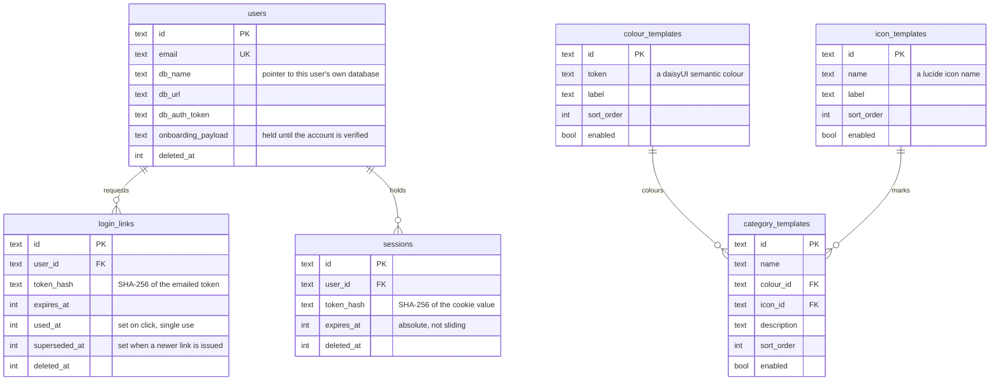
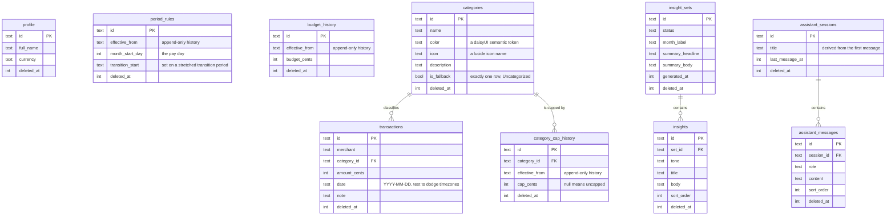
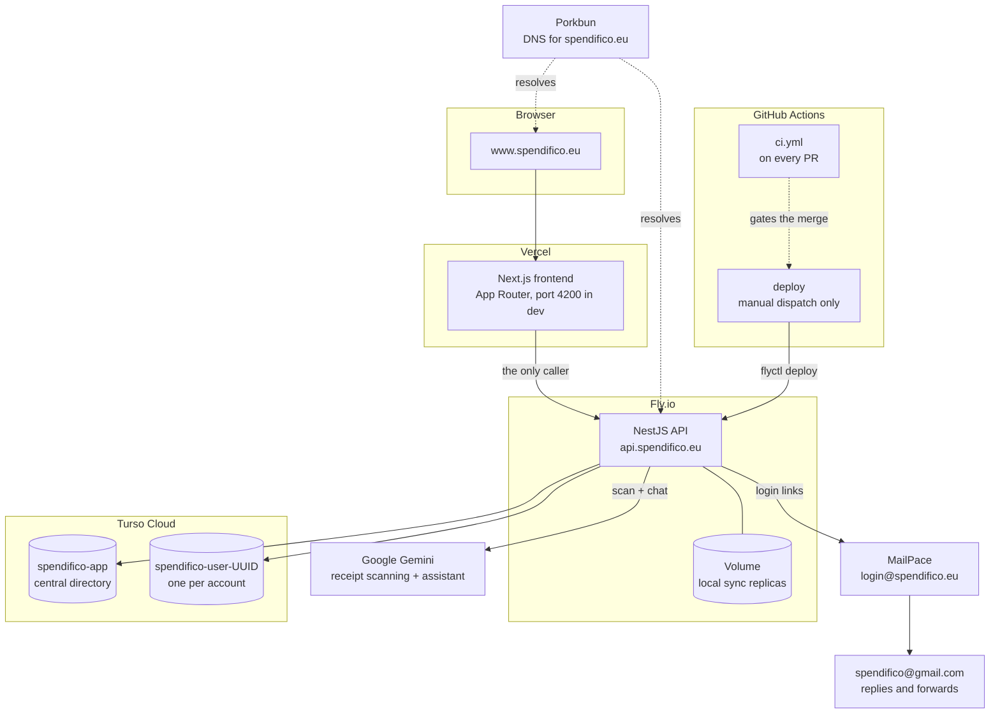
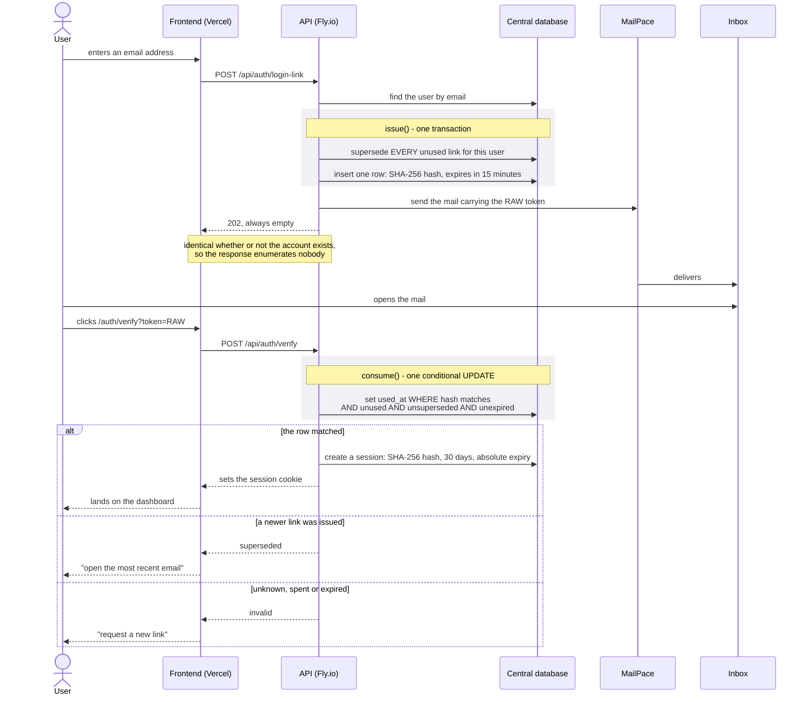

# Showcase diagrams

Draft diagrams for the showcase presentation. Mermaid sources, so GitHub renders them here and a
reviewer can correct the source rather than an image.

Three are drawn. Two more are candidates and are listed at the end.

---

## 1. The data model, both scopes

**Every user gets their own database.** That is the architectural claim of the backend, so the ERD is
two diagrams rather than one: a single central directory, and one private database per account whose
shape is repeated for every user.

**The relationship lines are logical, not enforced.** Neither schema declares a foreign key anywhere,
deliberately, because the Turso engine has `PRAGMA foreign_keys` off per connection and a declared
constraint would be decorative. Mermaid draws relationships as though they were constraints, so read
every line below as "the application maintains this", not "the database enforces it".

Every table also carries `deleted_at` and tombstones instead of deleting, which is why the row counts
a query returns depend on remembering to filter it.

### Central database: the user directory

One database, shared by everybody. It holds an email, a pointer to that person's own database, and the
two credentials that are checked before anything knows which database to open.

The three `*_templates` tables are the exception to "central holds only an email and a pointer": they
carry which starter categories onboarding offers and which colours and icons a category may take, as
the first step toward a super-admin panel.

### Per-user database: one of these per account

**The three `*_history` tables are the shape worth pointing at.** Budget, category caps and the day a
period starts on are append-only and effective-dated, resolved on read. A change applies from a date
and never backwards, which is what stops raising the budget in 2026 from silently re-pricing every
month of 2025.

---

## 2. Deployment and infrastructure

Five hosted services and one API key, each doing exactly one job.

Three things on it are decisions rather than topology:

- **The frontend is the only thing that calls the API.** No other client exists, which is what lets the
  HTTP contract be generated from the backend and committed.
- **`main` does not auto-deploy the backend.** The deploy is workflow-dispatch only, so an endpoint can
  be merged and absent from production, which has happened.
- **The Fly volume holds sync replicas, not the source of truth.** Turso Cloud is authoritative, and a
  replica that disagrees is repaired by deleting it and letting it re-bootstrap.

---

## 3. Passwordless login

There is no password field anywhere in the app. Access is an emailed single-use link.

Four details on it are the ones people ask about:

- **The raw token is never stored.** Only its SHA-256 goes in the row, and the hash is the lookup key
  rather than a secret to compare, so verification has no timing-sensitive branch in it.
- **A link is single use**, by one conditional UPDATE rather than a read followed by a write. Whichever
  of two concurrent clicks runs second matches zero rows.
- **Only the newest link ever works.** Requesting a link supersedes every unused one for that account,
  so a resend cannot leave two doors open.
- **"Superseded" is told apart from "invalid"** because it is the one rejection a user can act on, and
  disclosing it enumerates nobody: it is only ever returned to somebody holding a token that was
  genuinely emailed to the account owner.

---

## Candidates not yet drawn

- **One database per user**, from registration through to first open: what happens at the moment an
  account is verified, and where the per-database credentials come from.
- **Cancelling an AI request**, the three-hop abort chain from the composer to Gemini. There is already
  a plain-language write-up of it in `docs/explainers/cancelling-an-ai-request.md` to draw from.
